---
## Front matter
lang: ru-RU
title: "Лабораторная работа № 1."
subtitle: "Установка и конфигурация"
author:
  - Акопян С.М.
institute:
  - Российский университет дружбы народов, Москва, Россия

## i18n babel
babel-lang: russian
babel-otherlangs: english

## Fonts
mainfont: PT Sans
romanfont: PT Sans
sansfont: PT Sans
monofont: PT Sans
mainfontoptions: Ligatures=TeX
romanfontoptions: Ligatures=TeX
sansfontoptions: Ligatures=TeX,Scale=MatchLowercase
monofontoptions: Scale=MatchLowercase,Scale=0.9

## Formatting pdf
toc: false
toc-title: Содержание
slide_level: 2
aspectratio: 169
section-titles: true
theme: metropolis
header-includes:
 - \metroset{progressbar=frametitle,sectionpage=progressbar,numbering=fraction}
 - '\makeatletter'
 - '\beamer@ignorenonframefalse'
 - '\makeatother'
---
## Выполнение лабораторной работы

1. Следует создать новую виртуальную машину. Для этого в VirtualBox выбираем: машина -> создать. Указываем имя виртуальной машины тип операционной системы — Linux, RedHat (64-bit), а также размер оперативной памяти, конфигурацию жесткого диска и его размер.

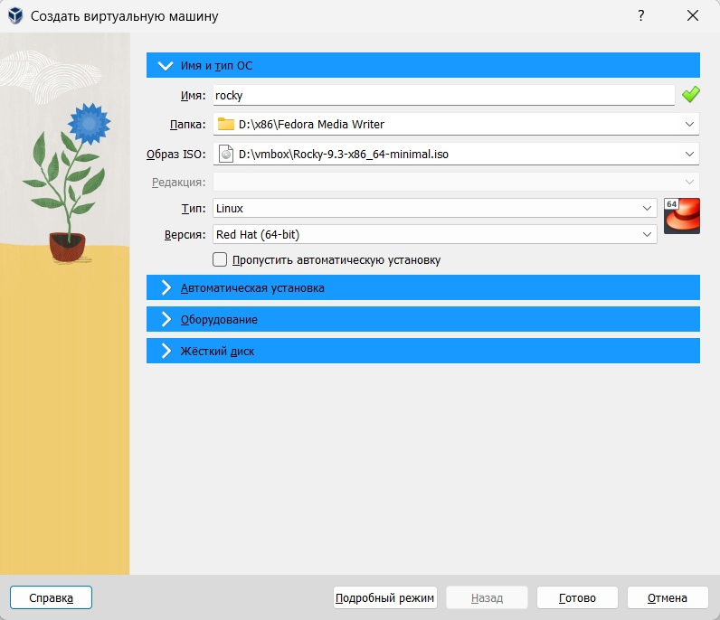{#fig:001 width=50%}

## Выполнение лабораторной работы

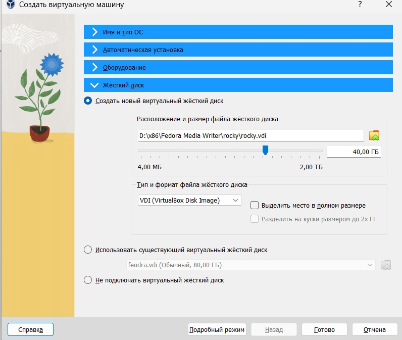{#fig:002 width=50%}

## Выполнение лабораторной работы

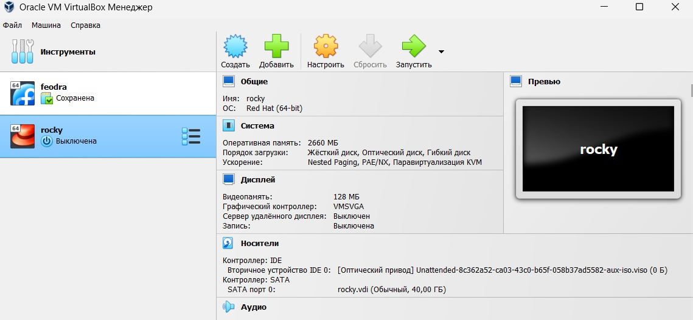{#fig:003 width=50%}

## Выполнение лабораторной работы

2. Следуюющим шагом следует запустить виртуальную машину, выбрать English в качестве
языка интерфейса и перейти к настройкам установки операционной системы 

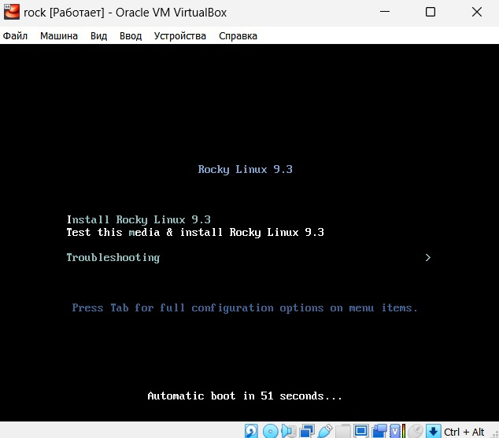{#fig:004 width=50%}

## Выполнение лабораторной работы

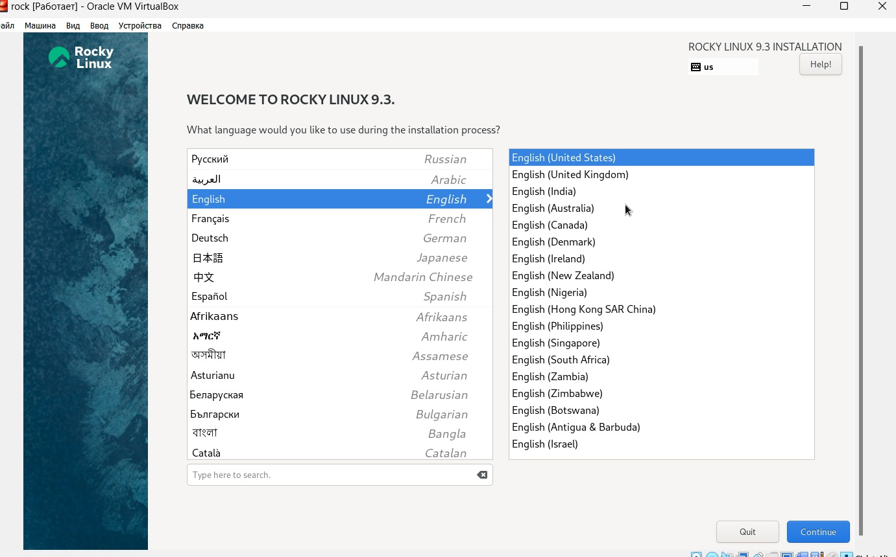{#fig:005 width=50%}

## Выполнение лабораторной работы

3.  В разделе выбора программ указываем в качестве базового окружения "Server with GUI" , а в качестве дополнения — "Development Tools"

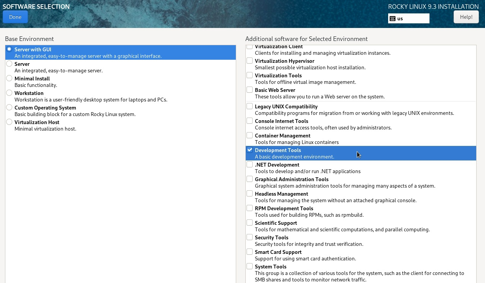{#fig:007 width=50%}

## Выполнение лабораторной работы

4. Включаем сетевое соединение и в качестве имени узла указываем user.localdomain 

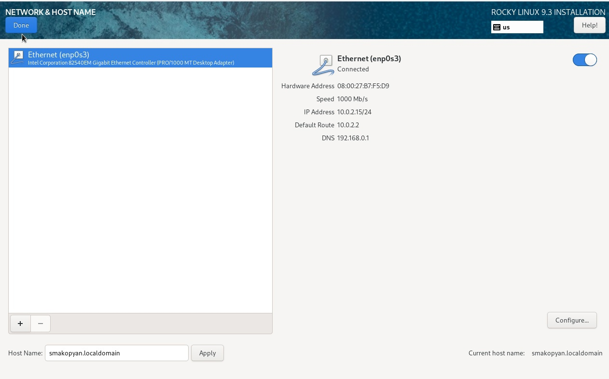{#fig:008 width=50%} 

## Выполнение лабораторной работы

5. Установливаем пароль для root и пользователя с правами администратора. 

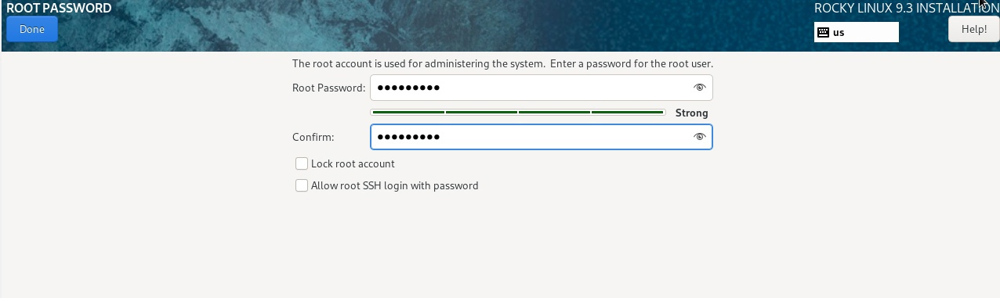{#fig:009 width=50%}

## Выполнение лабораторной работы

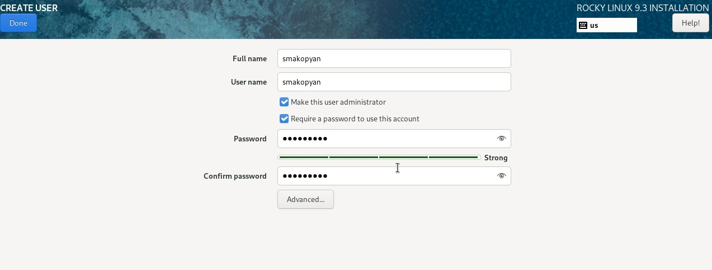{#fig:010 width=50%}

## Выполнение лабораторной работы

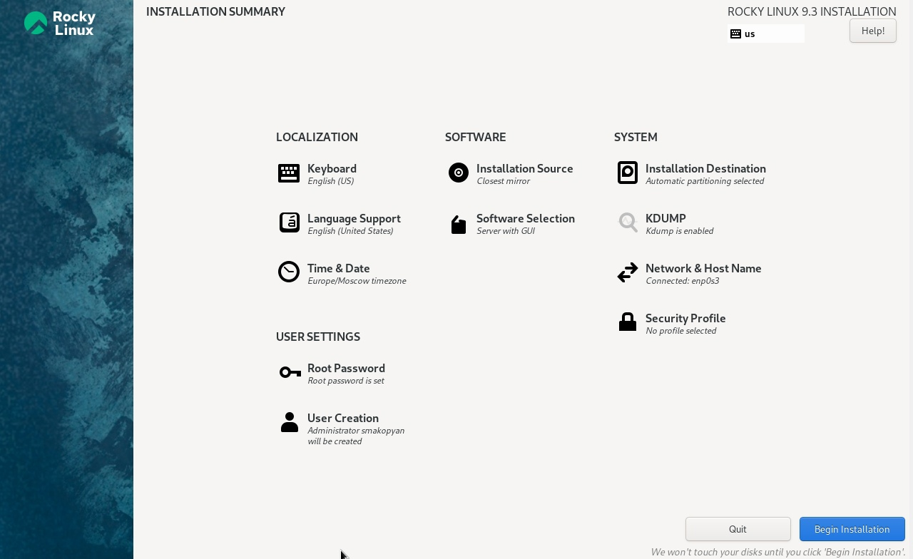{#fig:011 width=50%}

## Выполнение лабораторной работы

6. После завершения установки операционной системы следует корректно перезапустить виртуальную машину 
 
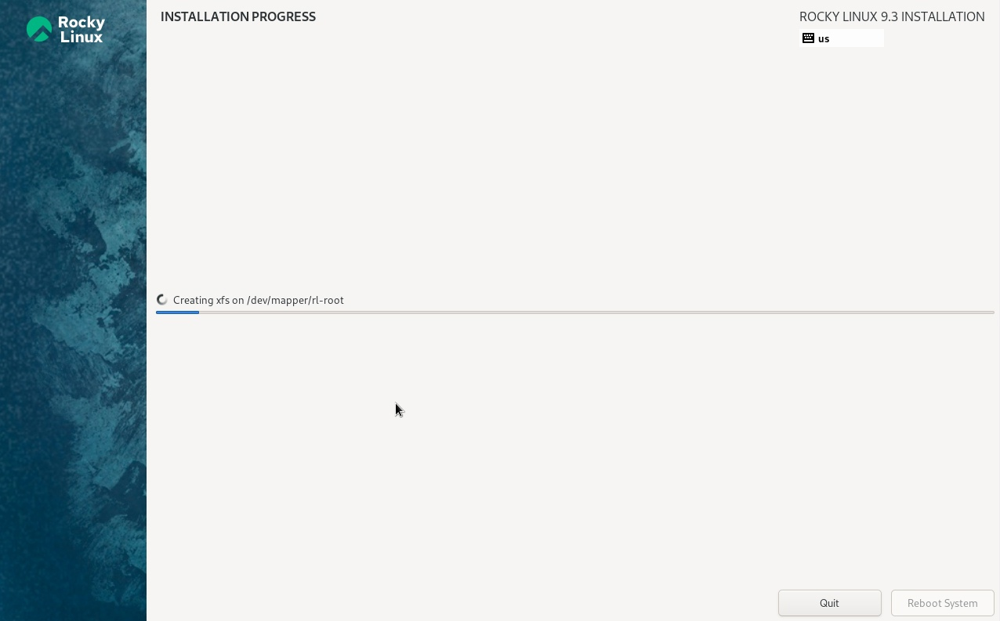{#fig:012 width=50%}

## Выполнение лабораторной работы

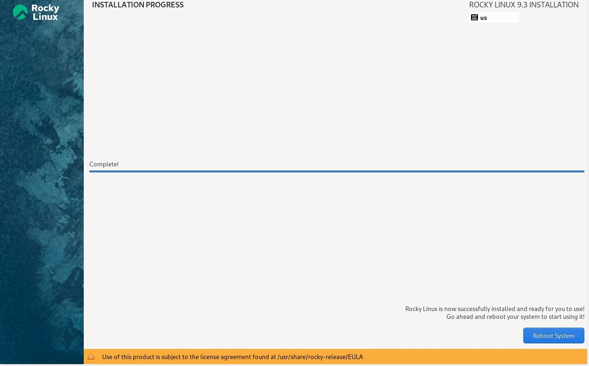{#fig:013 width=50%}

## Выполнение лабораторной работы

7. Заходим в ОС под заданной при установке учётной записью. В меню
Устройства виртуальной машины подключаем образ диска дополнений госте-
вой ОС 

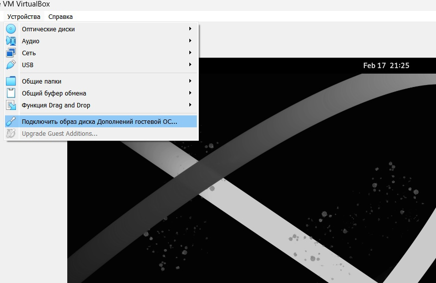{#fig:014 width=50%}

## Домашнее задание

Получите следующую информацию.
1. Версия ядра Linux (Linux version).

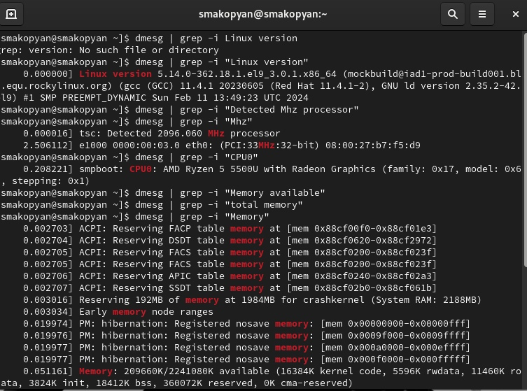{#fig:017 width=50%}

## Домашнее задание

2. Частота процессора (Detected Mhz processor).

{#fig:018 width=50%}

## Домашнее задание

3. Модель процессора (CPU0).

{#fig:019 width=50%}

## Домашнее задание

4. Объем доступной оперативной памяти (Memory available).

{#fig:020 width=50%}

## Домашнее задание

5. Тип обнаруженного гипервизора (Hypervisor detected).

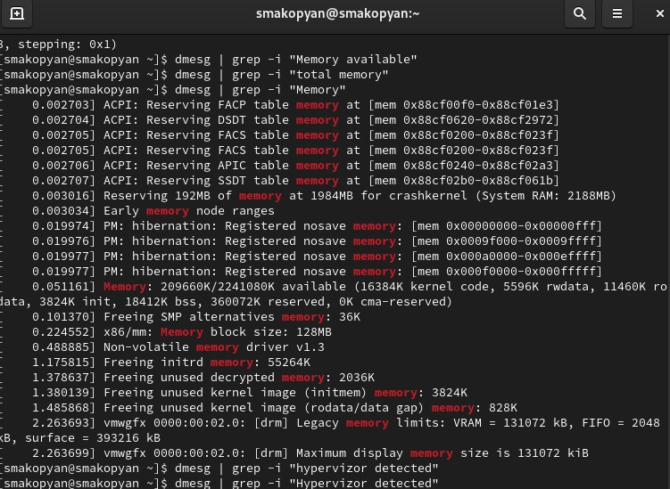{#fig:021 width=50%}

## Выводы

В результате данной лабораторной работы я приобрела практические навыки
установки операционной системы на виртуальную машину, настройки минимально необходимых для дальнейшей работы сервисов.

