---
## Front matter
title: "Лабораторная работа № 1."
subtitle: "Установка и конфигурация
операционной системы на виртуальную машину"
author: "Акопян Сатеник Манвеловна"

## Generic otions
lang: ru-RU
toc-title: "Содержание"

## Bibliography
bibliography: bib/cite.bib
csl: pandoc/csl/gost-r-7-0-5-2008-numeric.csl

## Pdf output format
toc: true # Table of contents
toc-depth: 2
lof: true # List of figures
lot: true # List of tables
fontsize: 12pt
linestretch: 1.5
papersize: a4
documentclass: scrreprt
## I18n polyglossia
polyglossia-lang:
  name: russian
  options:
	- spelling=modern
	- babelshorthands=true
polyglossia-otherlangs:
  name: english
## I18n babel
babel-lang: russian
babel-otherlangs: english
## Fonts
mainfont: PT Sans
romanfont: PT Sans
sansfont: PT Sans
monofont: PT Sans
mainfontoptions: Ligatures=TeX
romanfontoptions: Ligatures=TeX
sansfontoptions: Ligatures=TeX,Scale=MatchLowercase
monofontoptions: Scale=MatchLowercase,Scale=0.9
## Biblatex
biblatex: true
biblio-style: "gost-numeric"
biblatexoptions:
  - parentracker=true
  - backend=biber
  - hyperref=auto
  - language=auto
  - autolang=other*
  - citestyle=gost-numeric
## Pandoc-crossref LaTeX customization
figureTitle: "Рис."
tableTitle: "Таблица"
listingTitle: "Листинг"
lofTitle: "Список иллюстраций"
lotTitle: "Список таблиц"
lolTitle: "Листинги"
## Misc options
indent: true
header-includes:
  - \usepackage{indentfirst}
  - \usepackage{float} # keep figures where there are in the text
  - \floatplacement{figure}{H} # keep figures where there are in the text
---

# Цель работы

Целью данной работы является приобретение практических навыков
установки операционной системы на виртуальную машину, настройки ми-
нимально необходимых для дальнейшей работы сервисов.

# Выполнение лабораторной работы

1. Следует создать новую виртуальную машину. Для этого в VirtualBox выбираем: машина -> создать. Указываем имя виртуальной машины тип операционной системы — Linux, RedHat (64-bit), а также размер оперативной памяти, конфигурацию жесткого диска и его размер.

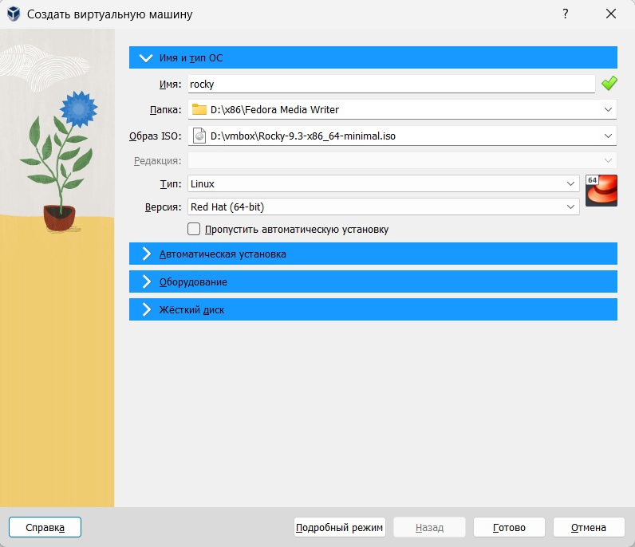{#fig:001 width=70%}

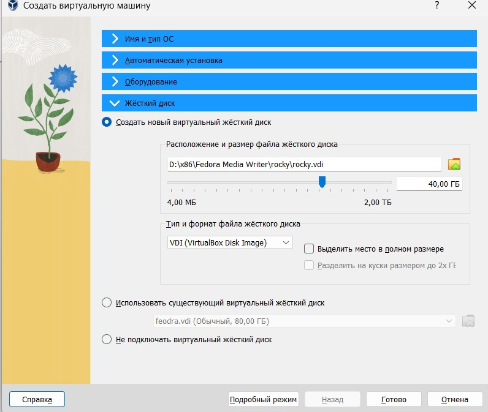{#fig:002 width=70%}

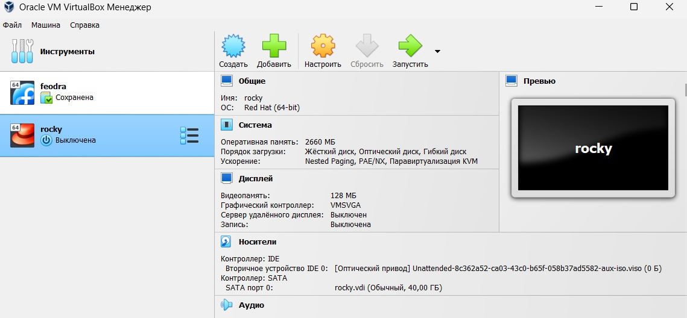{#fig:003 width=70%}

2. Следуюющим шагом следует запустить виртуальную машину, выбрать English в качестве
языка интерфейса и перейти к настройкам установки операционной системы 

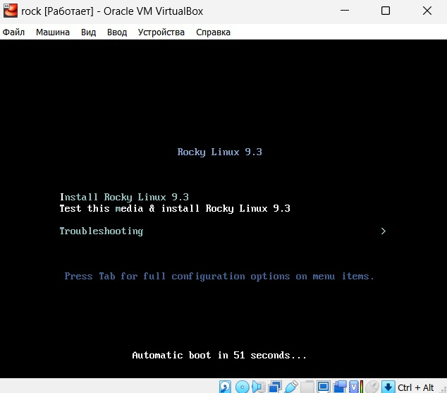{#fig:004 width=70%}

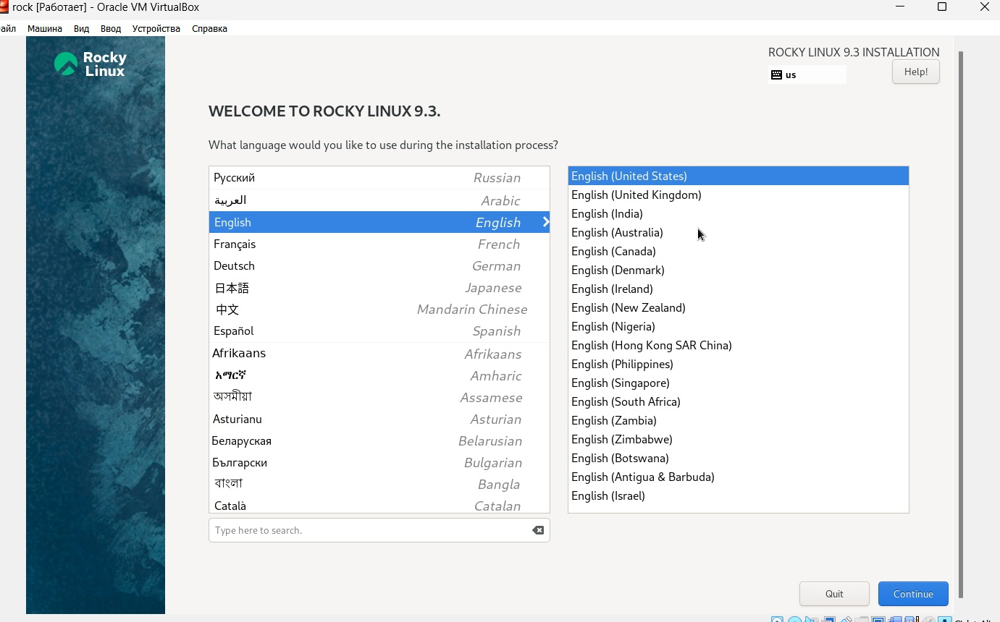{#fig:005 width=70%}

3.  В разделе выбора программ указываем в качестве базового окружения "Server with GUI" , а в качестве дополнения — "Development Tools"

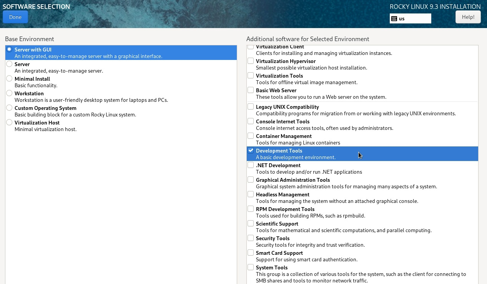{#fig:007 width=70%}

4. Включаем сетевое соединение и в качестве имени узла указываем user.localdomain 

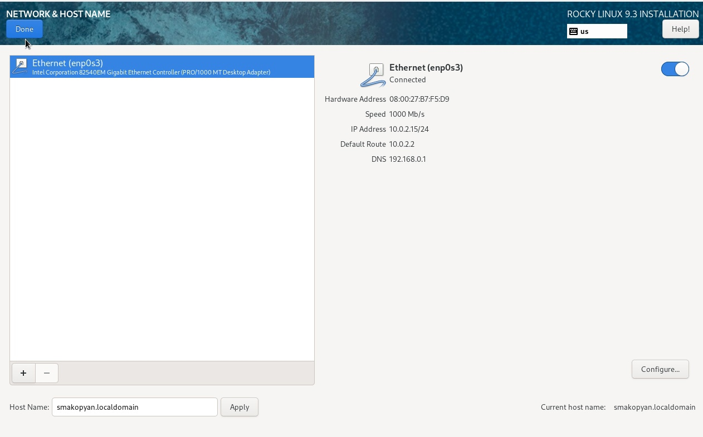{#fig:008 width=70%} 

5. Установливаем пароль для root и пользователя с правами администратора. 

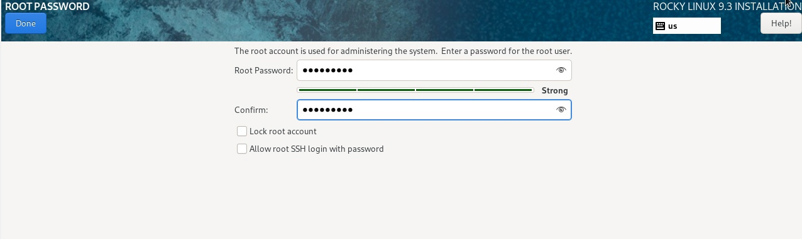{#fig:009 width=70%}

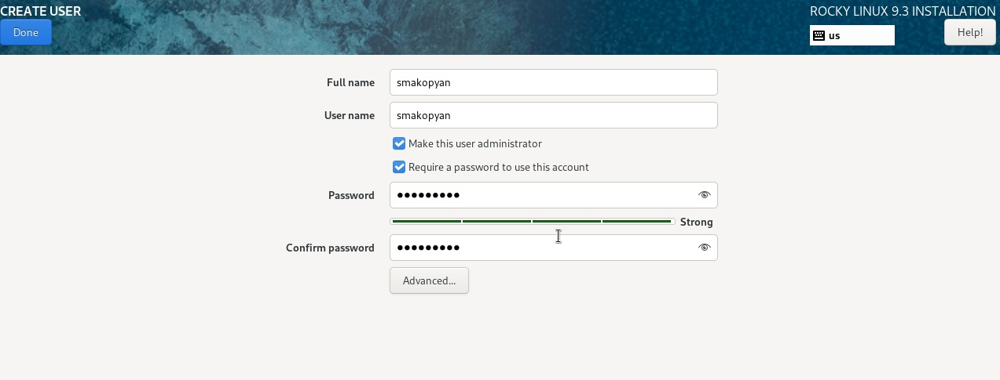{#fig:010 width=70%}

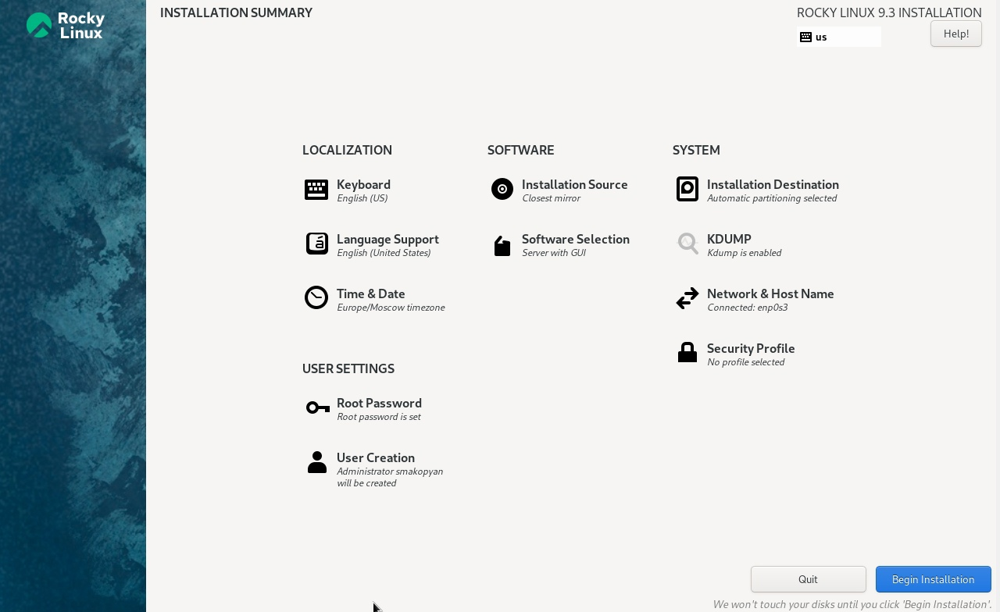{#fig:011 width=70%}
6. После завершения установки операционной системы следует корректно перезапустить виртуальную машину 
 
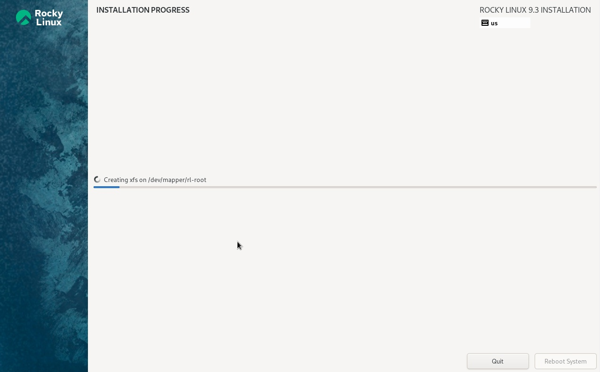{#fig:012 width=70%}

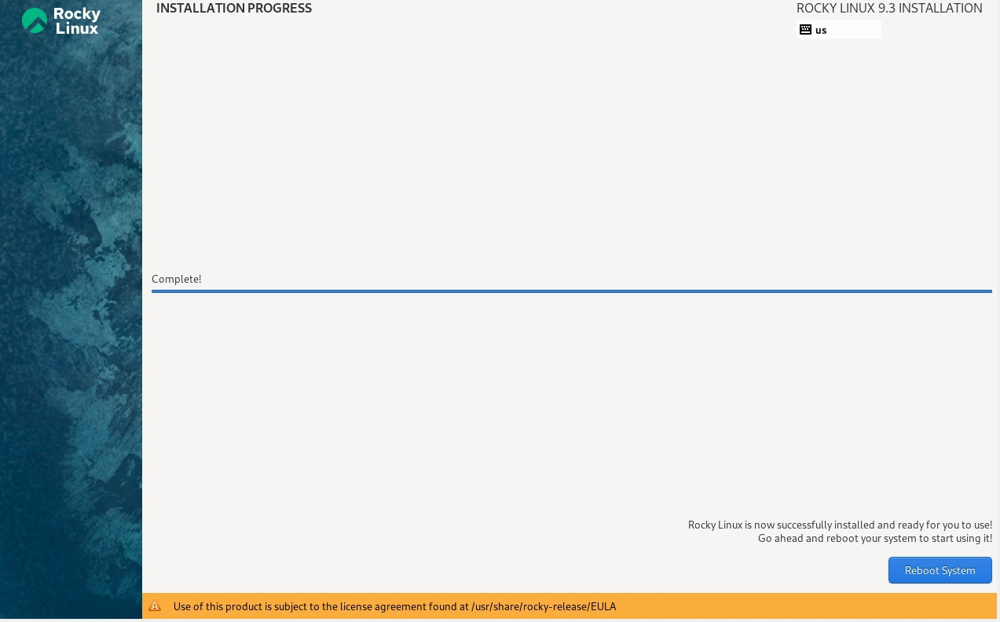{#fig:013 width=70%}

7. Заходим в ОС под заданной при установке учётной записью. В меню
Устройства виртуальной машины подключаем образ диска дополнений госте-
вой ОС 

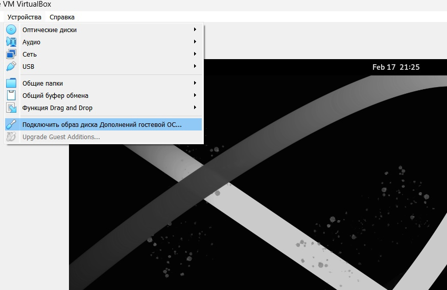{#fig:014 width=70%}

# Домашнее задание

Получите следующую информацию.
1. Версия ядра Linux (Linux version).

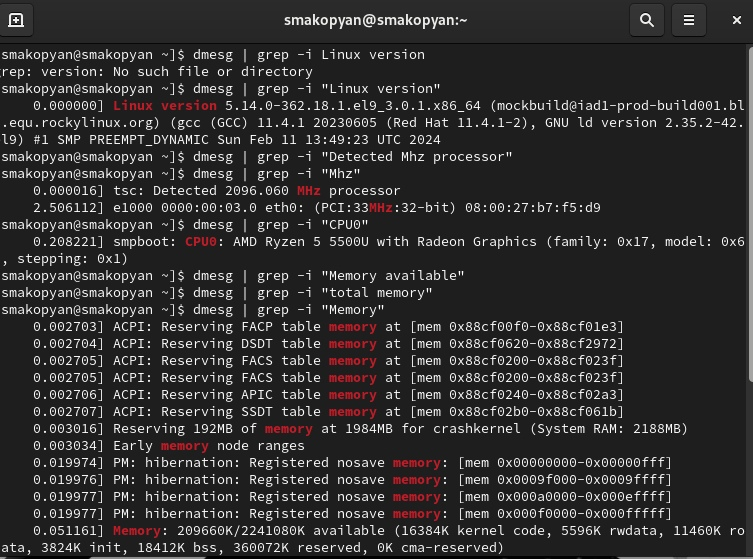{#fig:017 width=70%}

2. Частота процессора (Detected Mhz processor).

{#fig:018 width=70%}

3. Модель процессора (CPU0).

{#fig:019 width=70%}

4. Объем доступной оперативной памяти (Memory available).

{#fig:020 width=70%}

5. Тип обнаруженного гипервизора (Hypervisor detected).

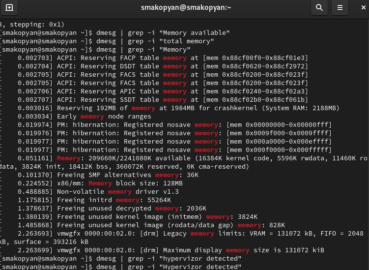{#fig:021 width=70%}

# Выводы

В результате данной лабораторной работы я приобрела практические навыки
установки операционной системы на виртуальную машину, настройки минимально необходимых для дальнейшей работы сервисов.

# Список литературы{.unnumbered}

::: {#refs}
:::
