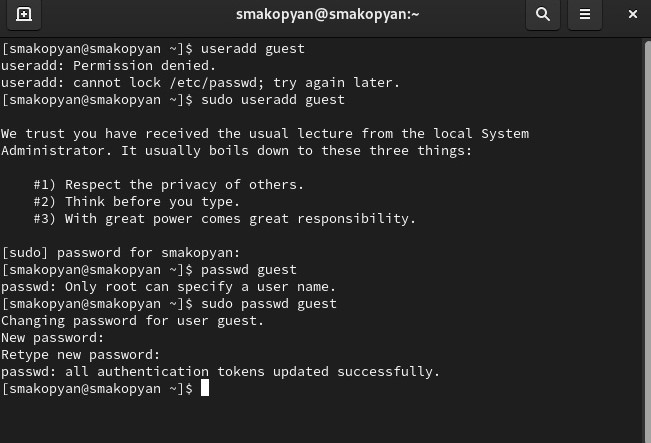
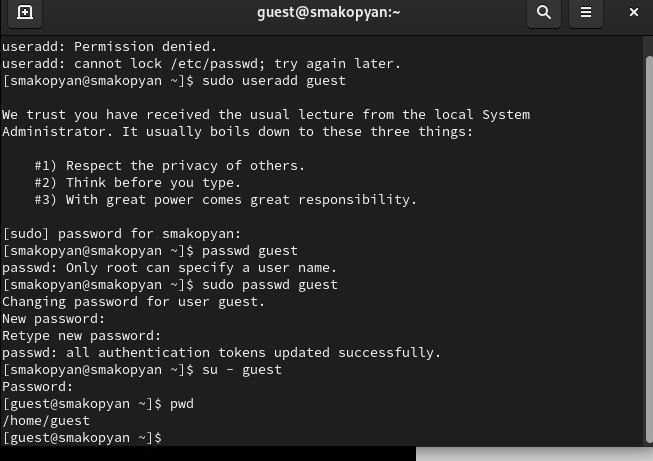
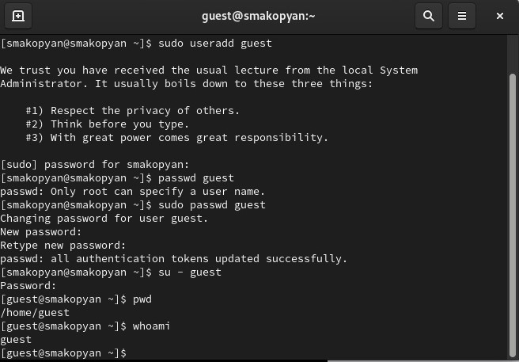
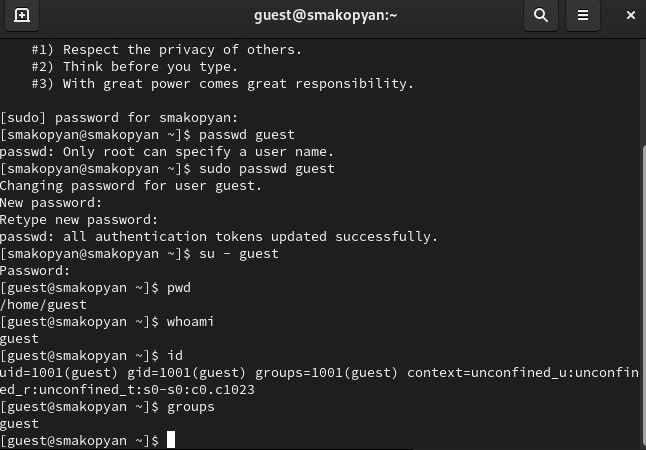
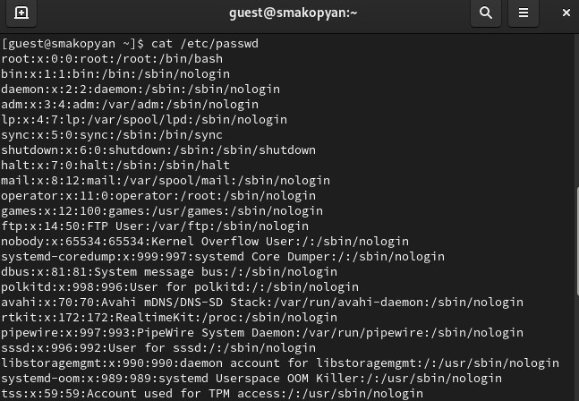
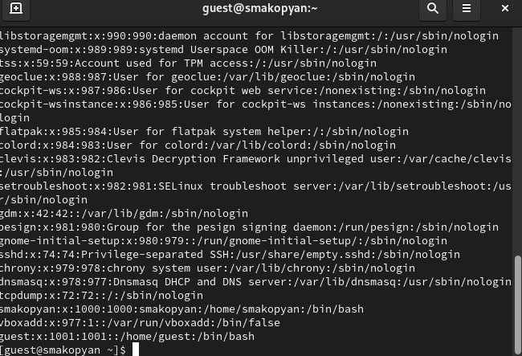
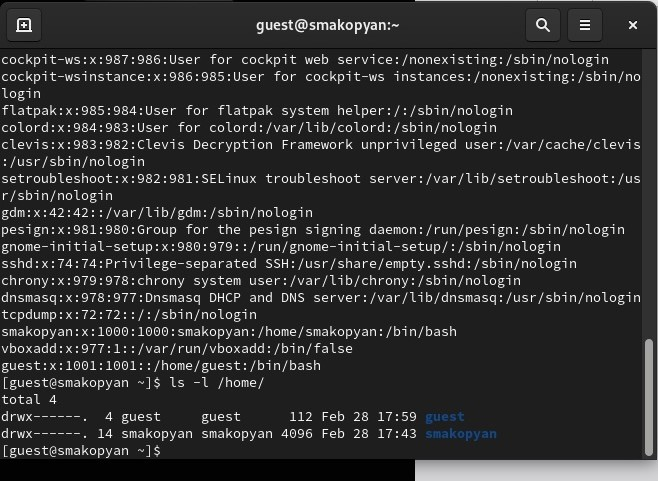
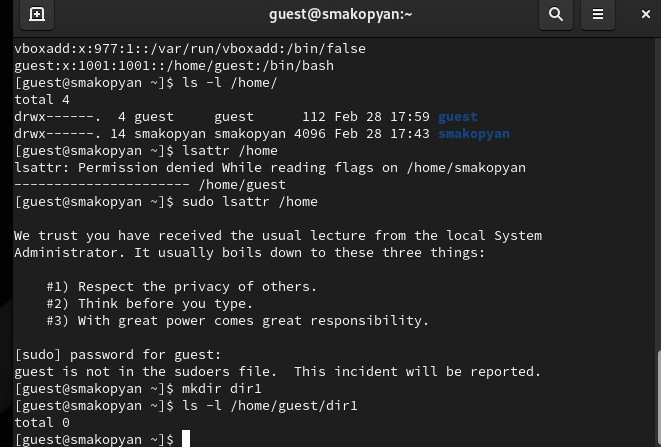
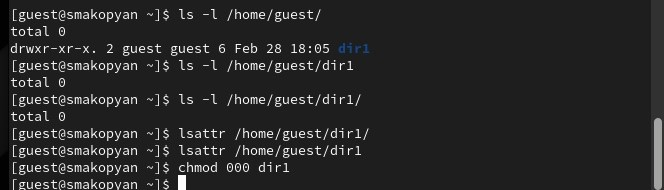
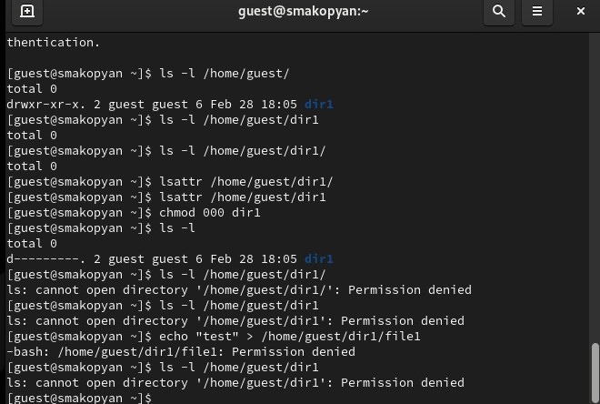

---
## Front matter
lang: ru-RU
title: Лабораторная работа № 2
subtitle: Дискреционное разграничение прав в Linux. Основные атрибуты
author:
  - Акопян Сатеник
institute:
  - Российский университет дружбы народов, Москва, Россия

## i18n babel
babel-lang: russian
babel-otherlangs: english

## Fonts
mainfont: PT Sans
romanfont: PT Sans
sansfont: PT Sans
monofont: PT Sans
mainfontoptions: Ligatures=TeX
romanfontoptions: Ligatures=TeX
sansfontoptions: Ligatures=TeX,Scale=MatchLowercase
monofontoptions: Scale=MatchLowercase,Scale=0.9

## Formatting pdf
toc: false
toc-title: Содержание
slide_level: 2
aspectratio: 169
section-titles: true
theme: metropolis
header-includes:
 - \metroset{progressbar=frametitle,sectionpage=progressbar,numbering=fraction}
 - '\makeatletter'
 - '\beamer@ignorenonframefalse'
 - '\makeatother'
---

## Цель работы

Получение практических навыков работы в консоли с атрибутами фай-
лов, закрепление теоретических основ дискреционного разграничения до-
ступа в современных системах с открытым кодом на базе ОС Linux1

## Выполнение лабораторной работы

1. В установленной при выполнении предыдущей лабораторной работы
операционной системе создайте учётную запись пользователя guest (ис-
пользую учётную запись администратора). Задайте пароль для пользователя guest (использую учётную запись администратора):

{#fig:001 width=50%}

## Выполнение лабораторной работы

2. Войдите в систему от имени пользователя guest (команда su). Определите директорию, в которой вы находитесь, командой pwd. 

{#fig:002 width=50%}

## Выполнение лабораторной работы

3. Уточните имя вашего пользователя командой whoami

{#fig:003 width=50%}

## Выполнение лабораторной работы

4. Уточните имя вашего пользователя, его группу, а также группы, куда входит пользователь, командой id. Выведенные значения uid, gid и др. запомните. Сравните вывод id с выводом команды groups.

{#fig:004 width=50%}

## Выполнение лабораторной работы

5. Просмотрите файл /etc/passwd командой cat /etc/passwd

{#fig:005 width=50%}

## Выполнение лабораторной работы

{#fig:006 width=50%}

## Выполнение лабораторной работы

6. Определите существующие в системе директории командой
ls -l /home/
Удалось ли вам получить список поддиректорий директории /home?(да) Ка-
кие права установлены на директориях? (Создание файла, Удаление файла, запись в файл, чтение файла, смена директории, просмотр файлов в директории, переименование файла, смена атрибутов файла)

{#fig:007 width=50%}

## Выполнение лабораторной работы

7. Проверьте, какие расширенные атрибуты установлены на поддиректориях, находящихся в директории /home, командой: lsattr /home Удалось ли вам увидеть расширенные атрибуты директории (нет)?Удалось ли вам увидеть расширенные атрибуты директорий других пользователей (нет)

## Выполнение лабораторной работы

{#fig:008 width=50%}

## Выполнение лабораторной работы

8. Создайте в домашней директории поддиректорию dir1 командой mkdir dir1

{#fig:009 width=50%}

## Выполнение лабораторной работы

9. Снимите с директории dir1 все атрибуты командой chmod 000 dir1 и проверьте с её помощью правильность выполнения команды ls -l

{#fig:010 width=50%}

## Выполнение лабораторной работы

10. Попытайтесь создать в директории dir1 файл file1 командой
echo "test" > /home/guest/dir1/file1
Объясните, почему вы получили отказ в выполнении операции по созда-
нию файла (так как на предыдущем этапе сняли все атрибуты с директории)?
Оцените, как сообщение об ошибке отразилось на создании файла? Про-
верьте командой (файл не создался)

{#fig:011 width=50%}

## Выводы
В результате данной лабораторной работы я получила практические навыки работы в консоли с атрибутами фай-
лов, закрепила теоретические основы дискреционного разграничения доступа в современных системах с открытым кодом на базе ОС Linux
