---
## Front matter
lang: ru-RU
title: Лабораторная работа № 3
subtitle: Дискреционное разграничение прав в Linux. Два пользователя
author:
  - Акопян Сатеник
institute:
  - Российский университет дружбы народов, Москва, Россия

## i18n babel
babel-lang: russian
babel-otherlangs: english

## Fonts
mainfont: PT Sans
romanfont: PT Sans
sansfont: PT Sans
monofont: PT Sans
mainfontoptions: Ligatures=TeX
romanfontoptions: Ligatures=TeX
sansfontoptions: Ligatures=TeX,Scale=MatchLowercase
monofontoptions: Scale=MatchLowercase,Scale=0.9

## Formatting pdf
toc: false
toc-title: Содержание
slide_level: 2
aspectratio: 169
section-titles: true
theme: metropolis
header-includes:
 - \metroset{progressbar=frametitle,sectionpage=progressbar,numbering=fraction}
 - '\makeatletter'
 - '\beamer@ignorenonframefalse'
 - '\makeatother'
---
## Цель работы

Получение практических навыков работы в консоли с атрибутами фай-
лов для групп пользователей.

## Выполнение лабораторной работы

1. Создайте пользователя guest2. Добавьте пользователя guest2 в группу guest (создание учетной записи пользоввателя guest было в предыдущей лабораторной работе)

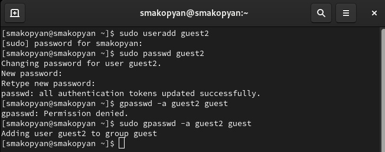{#fig:001 width=70%}

## Выполнение лабораторной работы

2. Осуществите вход в систему от двух пользователей на двух разных кон-
солях: guest на первой консоли и guest2 на второй консоли

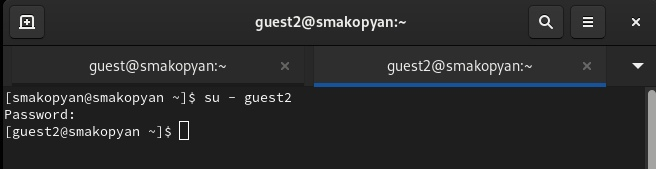{#fig:002 width=70%}

## Выполнение лабораторной работы

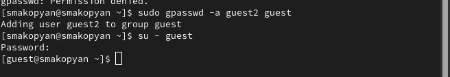{#fig:003 width=70%}

## Выполнение лабораторной работы

3. Для обоих пользователей командой pwd определите директорию, в кото-
рой вы находитесь. Сравните её с приглашениями командной строки

{#fig:004 width=70%}

## Выполнение лабораторной работы

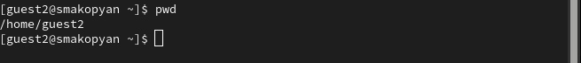{#fig:005 width=70%}

## Выполнение лабораторной работы

4. Уточните имя вашего пользователя (c помощью команды whoami определили имя пользователя), его группу, кто входит в неё (команда groups) и к каким группам принадлежит он сам(guest находится в группе guest, guest2 в группе guest2). Определите командами groups guest и groups guest2, в какие группы входят пользователи guest и guest2. Сравните вывод команды groups с выводом команд
id -Gn и id -G(вывод аналогичный, но немного по другому записан).

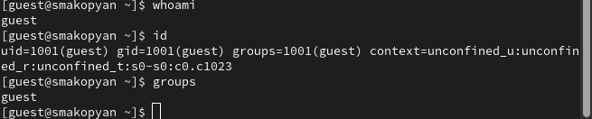{#fig:006 width=70%}

## Выполнение лабораторной работы

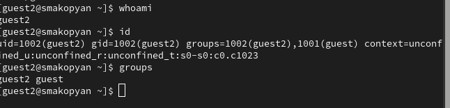{#fig:007 width=70%}

## Выполнение лабораторной работы

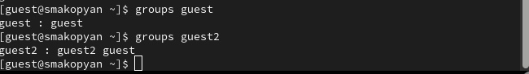{#fig:008 width=70%}

## Выполнение лабораторной работы

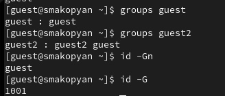{#fig:009 width=70%}

## Выполнение лабораторной работы

5. Сравните полученную информацию с содержимым файла /etc/group (видно, что пользователь guest2 находится в группе guest).
Просмотрите файл командой cat /etc/group

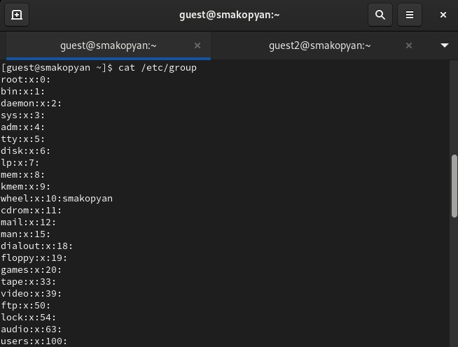{#fig:010 width=70%}

## Выполнение лабораторной работы

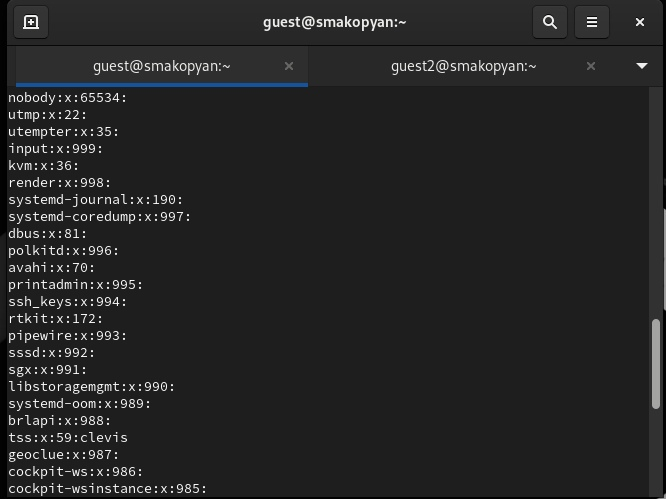{#fig:011 width=70%}

## Выполнение лабораторной работы

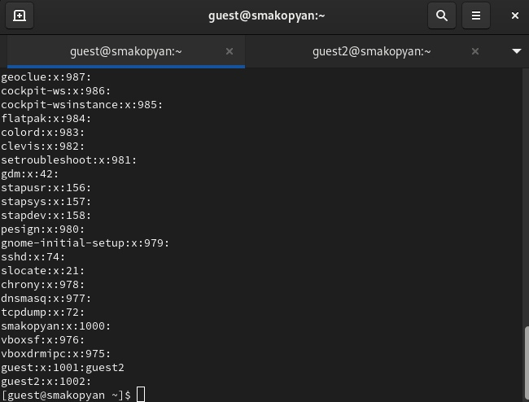{#fig:012 width=70%}

## Выполнение лабораторной работы

6. От имени пользователя guest2 выполните регистрацию пользователя
guest2 в группе guest командой newgrp guest

{#fig:013 width=70%}

## Выполнение лабораторной работы

7. Oт имени пользователя guest измените права директории /home/guest,
разрешив все действия для пользователей группы:
chmod g+rwx /home/guest

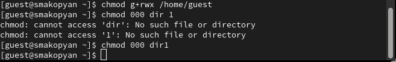{#fig:014 width=70%}

## Выполнение лабораторной работы

8. Oт имени пользователя guest снимите с директории /home/guest/dir1
все атрибуты командой
chmod 000 dirl

{#fig:015 width=70%}

## Выводы

В результате данной лабораторной работы я получила практические навыкои работы в консоли с атрибутами фай-
лов для групп пользователей.

