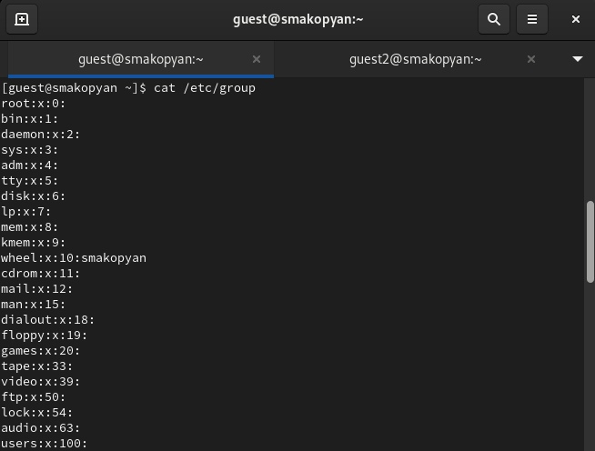
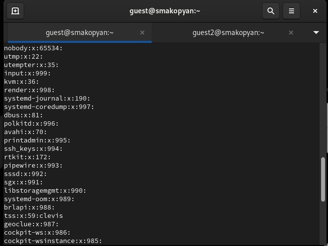

---
## Front matter
title: "Лабораторная работа № 3"
subtitle: "Дискреционное
разграничение прав в Linux. Два пользователя"
author: "Акопян Сатеник"

## Generic otions
lang: ru-RU
toc-title: "Содержание"

## Bibliography
bibliography: bib/cite.bib
csl: pandoc/csl/gost-r-7-0-5-2008-numeric.csl

## Pdf output format
toc: true # Table of contents
toc-depth: 2
lof: true # List of figures
lot: true # List of tables
fontsize: 12pt
linestretch: 1.5
papersize: a4
documentclass: scrreprt
## I18n polyglossia
polyglossia-lang:
  name: russian
  options:
	- spelling=modern
	- babelshorthands=true
polyglossia-otherlangs:
  name: english
## I18n babel
babel-lang: russian
babel-otherlangs: english
## Fonts
mainfont: PT Sans
romanfont: PT Sans
sansfont: PT Sans
monofont: PT Sans
mainfontoptions: Ligatures=TeX
romanfontoptions: Ligatures=TeX
sansfontoptions: Ligatures=TeX,Scale=MatchLowercase
monofontoptions: Scale=MatchLowercase,Scale=0.9
## Biblatex
biblatex: true
biblio-style: "gost-numeric"
biblatexoptions:
  - parentracker=true
  - backend=biber
  - hyperref=auto
  - language=auto
  - autolang=other*
  - citestyle=gost-numeric
## Pandoc-crossref LaTeX customization
figureTitle: "Рис."
tableTitle: "Таблица"
listingTitle: "Листинг"
lofTitle: "Список иллюстраций"
lotTitle: "Список таблиц"
lolTitle: "Листинги"
## Misc options
indent: true
header-includes:
  - \usepackage{indentfirst}
  - \usepackage{float} # keep figures where there are in the text
  - \floatplacement{figure}{H} # keep figures where there are in the text
---

# Цель работы

Получение практических навыков работы в консоли с атрибутами фай-
лов для групп пользователей.

# Выполнение лабораторной работы

1. Создайте пользователя guest2. Добавьте пользователя guest2 в группу guest (создание учетной записи пользоввателя guest было в предыдущей лабораторной работе)

{#fig:001 width=70%}

2. Осуществите вход в систему от двух пользователей на двух разных кон-
солях: guest на первой консоли и guest2 на второй консоли

{#fig:002 width=70%}

{#fig:003 width=70%}

3. Для обоих пользователей командой pwd определите директорию, в кото-
рой вы находитесь. Сравните её с приглашениями командной строки

{#fig:004 width=70%}

{#fig:005 width=70%}

4. Уточните имя вашего пользователя (c помощью команды whoami определили имя пользователя), его группу, кто входит в неё (команда groups) и к каким группам принадлежит он сам(guest находится в группе guest, guest2 в группе guest2). Определите командами groups guest и groups guest2, в какие группы входят пользователи guest и guest2. Сравните вывод команды groups с выводом команд
id -Gn и id -G(вывод аналогичный, но немного по другому записан).

{#fig:006 width=70%}

{#fig:007 width=70%}

{#fig:008 width=70%}

{#fig:009 width=70%}

5. Сравните полученную информацию с содержимым файла /etc/group (видно, что пользователь guest2 находится в группе guest).
Просмотрите файл командой cat /etc/group

{#fig:010 width=70%}

{#fig:011 width=70%}

{#fig:012 width=70%}

6. От имени пользователя guest2 выполните регистрацию пользователя
guest2 в группе guest командой newgrp guest

{#fig:013 width=70%}

7. Oт имени пользователя guest измените права директории /home/guest,
разрешив все действия для пользователей группы:
chmod g+rwx /home/guest

{#fig:014 width=70%}

8. Oт имени пользователя guest снимите с директории /home/guest/dir1
все атрибуты командой
chmod 000 dirl

{#fig:015 width=70%}

# Выводы

В результате данной лабораторной работы я получила практические навыкои работы в консоли с атрибутами фай-
лов для групп пользователей.

# Список литературы{.unnumbered}

::: {#refs}
:::
