---
## Front matter
title: "Лабораторная работа №4"
subtitle: "Дискреционное
разграничение прав в Linux. Расширенные
атрибуты"
author: "Акопян Сатеник"

## Generic otions
lang: ru-RU
toc-title: "Содержание"

## Bibliography
bibliography: bib/cite.bib
csl: pandoc/csl/gost-r-7-0-5-2008-numeric.csl

## Pdf output format
toc: true # Table of contents
toc-depth: 2
lof: true # List of figures
lot: true # List of tables
fontsize: 12pt
linestretch: 1.5
papersize: a4
documentclass: scrreprt
## I18n polyglossia
polyglossia-lang:
  name: russian
  options:
	- spelling=modern
	- babelshorthands=true
polyglossia-otherlangs:
  name: english
## I18n babel
babel-lang: russian
babel-otherlangs: english
## Fonts
mainfont: PT Sans
romanfont: PT Sans
sansfont: PT Sans
monofont: PT Sans
mainfontoptions: Ligatures=TeX
romanfontoptions: Ligatures=TeX
sansfontoptions: Ligatures=TeX,Scale=MatchLowercase
monofontoptions: Scale=MatchLowercase,Scale=0.9
## Biblatex
biblatex: true
biblio-style: "gost-numeric"
biblatexoptions:
  - parentracker=true
  - backend=biber
  - hyperref=auto
  - language=auto
  - autolang=other*
  - citestyle=gost-numeric
## Pandoc-crossref LaTeX customization
figureTitle: "Рис."
tableTitle: "Таблица"
listingTitle: "Листинг"
lofTitle: "Список иллюстраций"
lotTitle: "Список таблиц"
lolTitle: "Листинги"
## Misc options
indent: true
header-includes:
  - \usepackage{indentfirst}
  - \usepackage{float} # keep figures where there are in the text
  - \floatplacement{figure}{H} # keep figures where there are in the text
---

# Цель работы

Получение практических навыков работы в консоли с расширенными
атрибутами файлов

# Выполнение лабораторной работы

1. От имени пользователя guest определите расширенные атрибуты файла
/home/guest/dirl/filel командой
lsattr /home/guest/dirl/filel

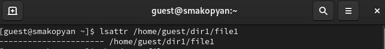{#fig:001 width=70%}

2. Установите командой chmod 600 file1 на файл filel права, разрешающие чтение и запись для владельца фай-ла.

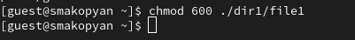{#fig:002 width=70%)

3. Попробуйте установить на файл /home/guest/dirl/filel расширенный атрибут а от имени пользователя guest:
chattr +a /home/guest/dirl/filel

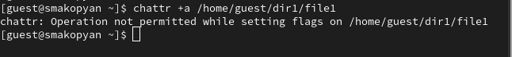{#fig:003 width=70%}

4. Зайдите на третью консоль с правами администратора либо повысьте В свои права с помощью команды su. Попробуйте установить расширен-9 ный атрибут а на файл /home/guest/dirl/filel от имени суперпользователя:
chattr +a /home/guest/dirl/filel

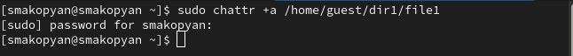{#fig:004 width=70%}

5. От пользователя guest проверьте правильность установления атрибута:
Lsattr /home/guest/dirl/filel

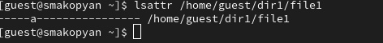{#fig:005 width=70%}

6. Выполните дозапись в файл file1 слова «test» командой
echo "test" /home/guest/dirl/file1
После этого выполните чтение файла file1 командой
cat /home/guest/dirl/filel
Убедитесь, что слово test было успешно записано в file1

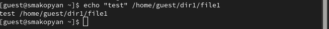{#fig:006 width=70%}

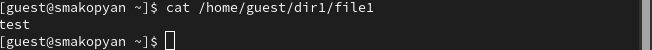{#fig:007 width=70%}

7. Попробуйте удалить файл filel либо стереть имеющуюся в нём информацию командой
echo "abcd" › /home/guest/dirl/filel

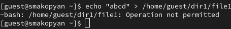{#fig:008 width=70%}

8. Попробуйте с помоцью команды chmod 000 filel установить на файл filel права, например, запрещающие чтение и запись для владельца файла. Удалось ли вам успешно выполнить указанные команды? (не удалось)

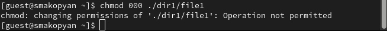{#fig:009 width=70%}

9. Снимите расширенный атрибут a с файла /home/guest/dirl/file1 от
имени суперпользователя командой
chattr -a /home/guest/dir1/file1
Повторите операции, которые вам ранее не удавалось выполнить. Ваши
наблюдения занесите в отчёт.

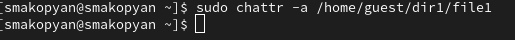{#fig:010 width=70%}

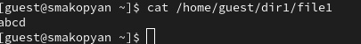{#fig:011 width=70%}

10. Повторите ваши действия по шагам, заменив атрибут «a» атрибутом «i».
Удалось ли вам дозаписать информацию в файл?(дозаписать информацию в файл не удалось, поменять атрибуты тоже) 

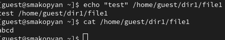{#fig:012 width=70%}

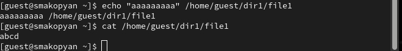{#fig:013 width=70%}

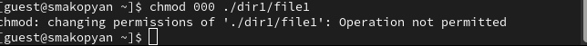{#fig:014 width=70%}

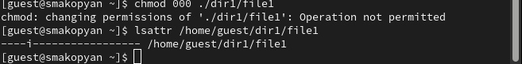{#fig:015 width=70%}

# Выводы

В результате данной лабораторной работы я получила практические навыки работы в консоли с расширенными
атрибутами файлов

# Список литературы{.unnumbered}

::: {#refs}
:::
