---
## Front matter
lang: ru-RU
title: Индпвидуальный проект
subtitle: 1 этап
author:
  - Акопян С.М.
institute:
  - Российский университет дружбы народов, Москва, Россия

## i18n babel
babel-lang: russian
babel-otherlangs: english

## Fonts
mainfont: PT Sans
romanfont: PT Sans
sansfont: PT Sans
monofont: PT Sans
mainfontoptions: Ligatures=TeX
romanfontoptions: Ligatures=TeX
sansfontoptions: Ligatures=TeX,Scale=MatchLowercase
monofontoptions: Scale=MatchLowercase,Scale=0.9

## Formatting pdf
toc: false
toc-title: Содержание
slide_level: 2
aspectratio: 169
section-titles: true
theme: metropolis
header-includes:
 - \metroset{progressbar=frametitle,sectionpage=progressbar,numbering=fraction}
 - '\makeatletter'
 - '\beamer@ignorenonframefalse'
 - '\makeatother'
---

## Цель работы

Целью данной лабораторной работы является установка Kali Linux

## Выполнение лабораторной работы

1. Устанавливаем образ операционной системы

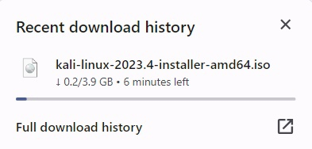{#fig:001 width=70%}

## Выполнение лабораторной работы

2. Следует создать новую виртуальную машину. Для этого в VirtualBox выбираем: машина -> создать. Указываем имя виртуальной машины тип операционной системы, а также размер оперативной памяти, конфигурацию жесткого диска и его размер.

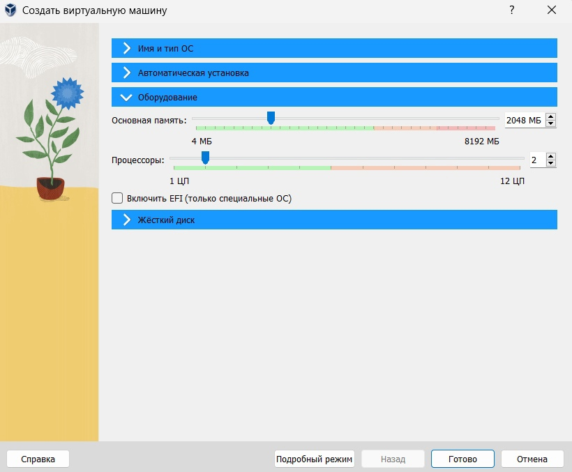{#fig:002 width=70%}

## Выполнение лабораторной работы

{#fig:003 width=70%}

## Выполнение лабораторной работы

{#fig:004 width=70%}

## Выполнение лабораторной работы

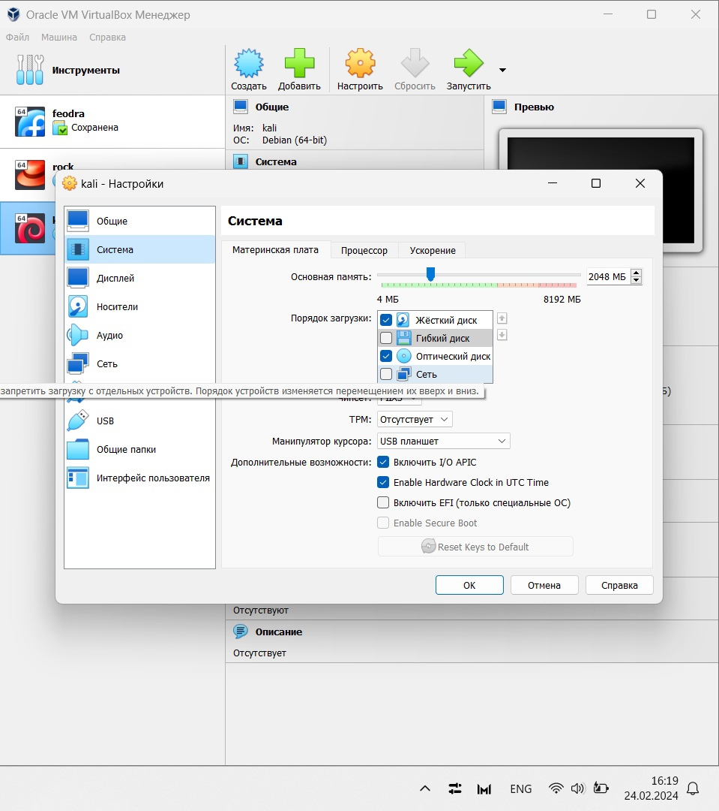{#fig:005 width=70%}

## Выполнение лабораторной работы

3. Выбираем 1 пункт установки

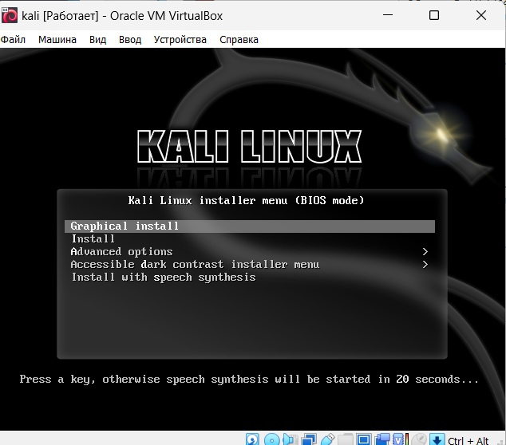{#fig:006 width=70%}

## Выполнение лабораторной работы

4. Выбираем локацию и язык, а также способ переключения клавиатуры

{#fig:007 width=70%}

## Выполнение лабораторной работы

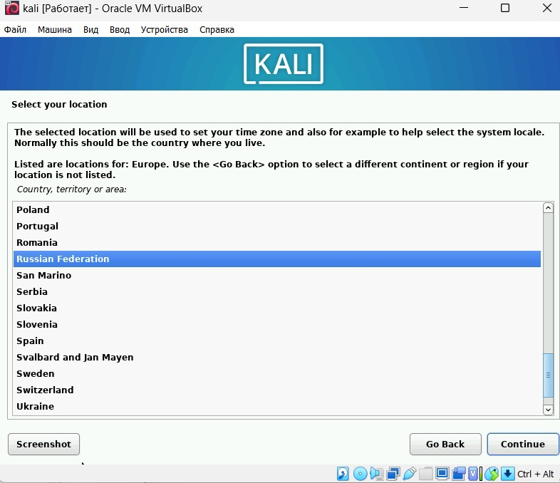{#fig:008 width=70%} 

## Выполнение лабораторной работы

{#fig:009 width=70%}

## Выполнение лабораторной работы

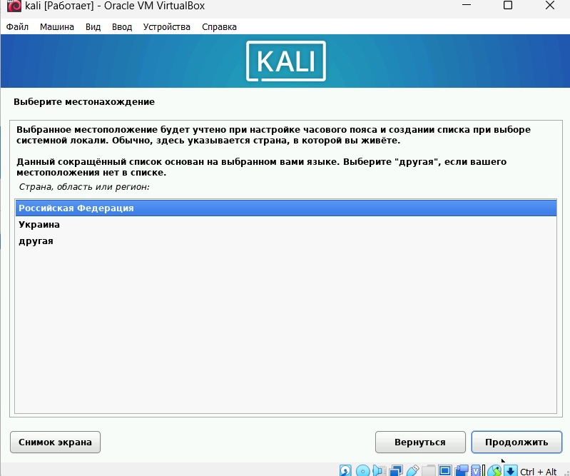{#fig:010 width=70%}

## Выполнение лабораторной работы

5. Вводим имя хоста и пользователя, а также пароль

{#fig:011 width=70%}

## Выполнение лабораторной работы

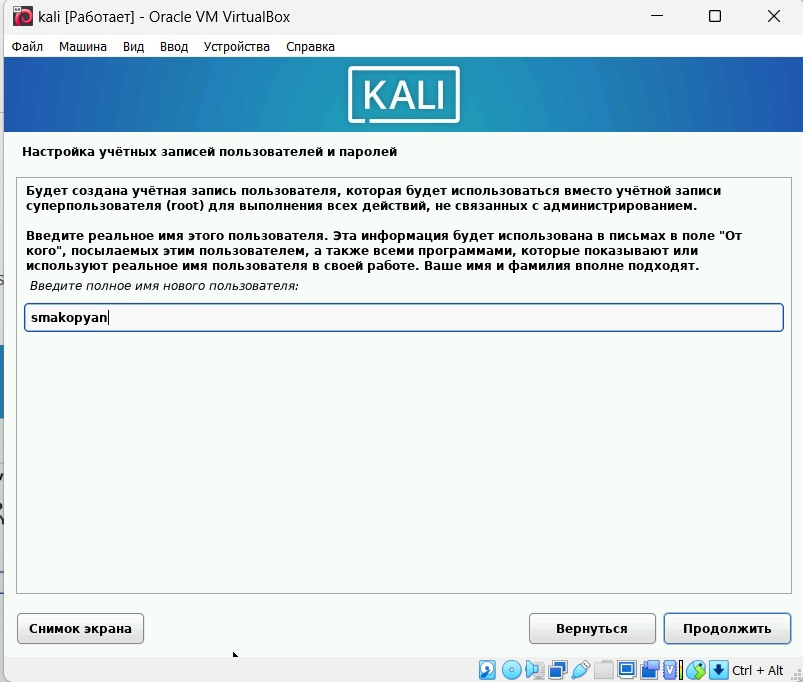{#fig:012 width=70%}

## Выполнение лабораторной работы

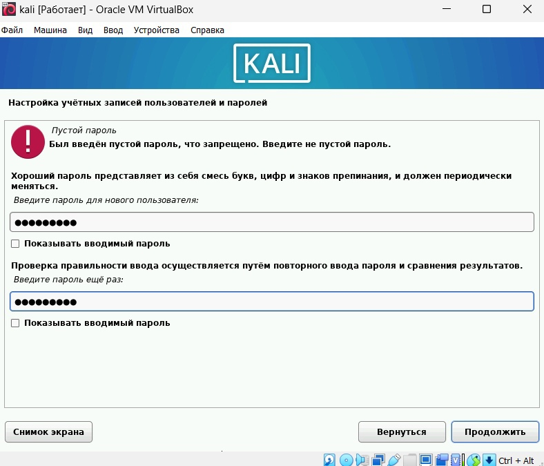{#fig:013 width=70%}

## Выполнение лабораторной работы

6. Выбираем нужный часовой пояс

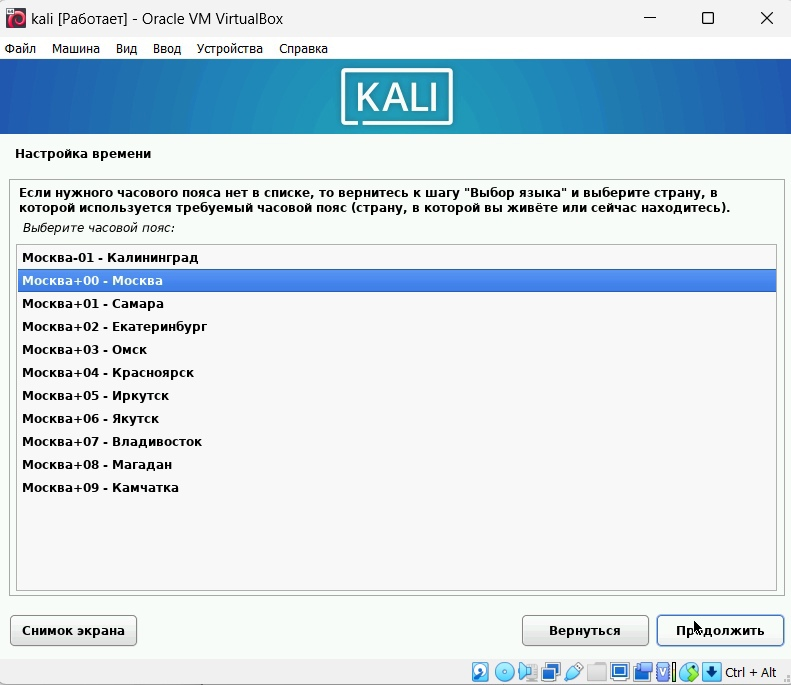{#fig:014 width=70%}

## Выполнение лабораторной работы

7. Делаем последние настройки и перезапускаем систему

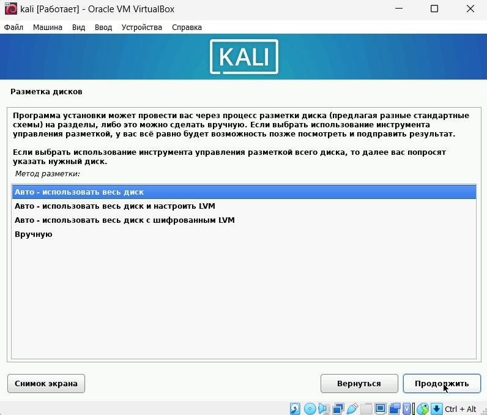{#fig:015 width=70%}

## Выполнение лабораторной работы

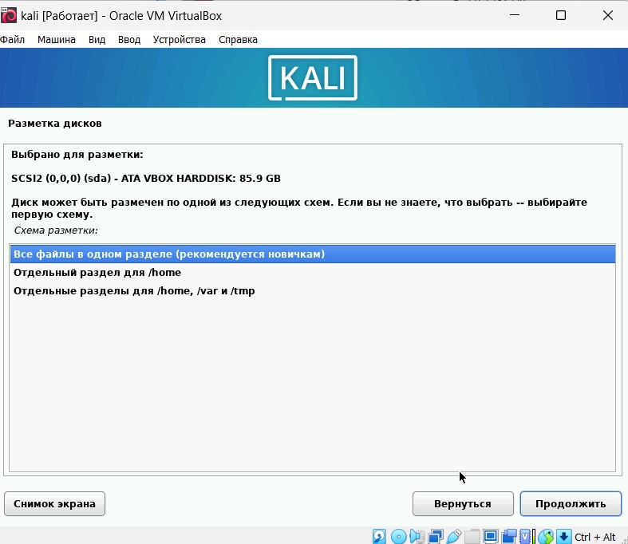{#fig:016 width=70%}

## Выполнение лабораторной работы

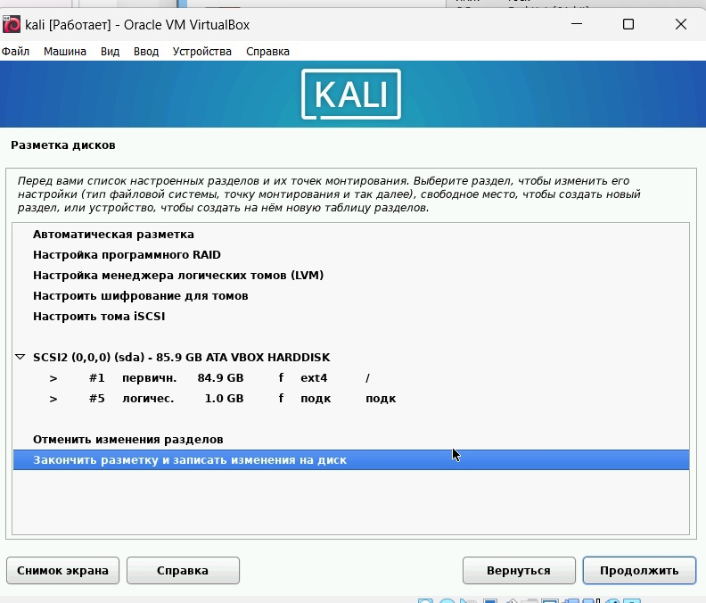{#fig:017 width=70%}

## Выполнение лабораторной работы

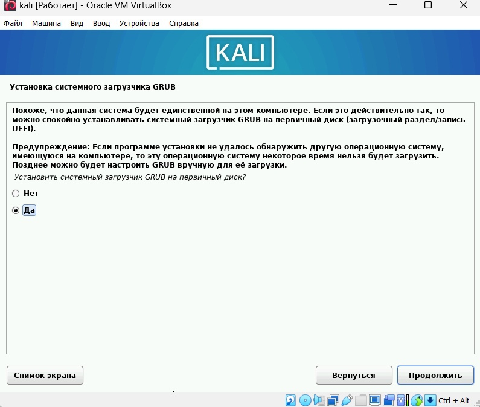{#fig:018 width=70%}

## Выполнение лабораторной работы

{#fig:019 width=70%}

## Выполнение лабораторной работы

{#fig:020 width=70%}

## Выполнение лабораторной работы

8. Заходим в систему под заданным именем пользователя и паролем

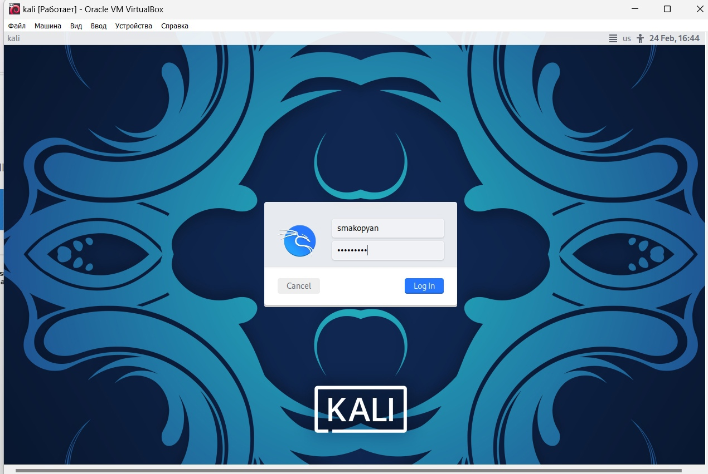{#fig:021 width=70%}

## Выполнение лабораторной работы

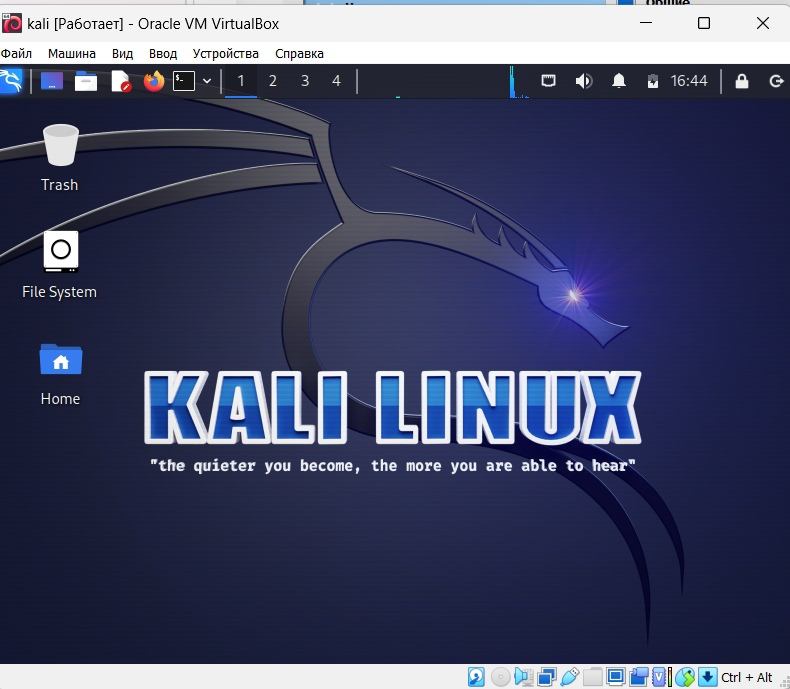{#fig:022 width=70%}

## Выводы

В результате данной лабораторной работы я установила Kali Linux

