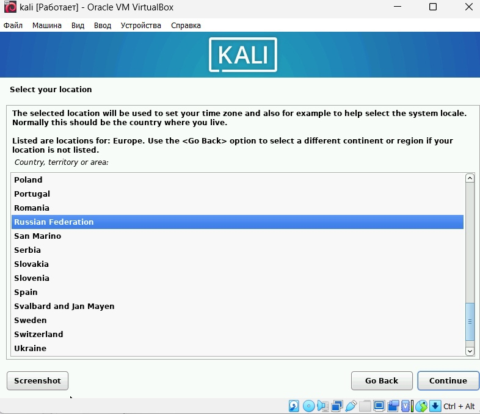

---
## Front matter
title: "индивидуальный проект"
subtitle: "1 этап"
author: "Акопян Сатеник Манвеловна"

## Generic otions
lang: ru-RU
toc-title: "Содержание"

## Bibliography
bibliography: bib/cite.bib
csl: pandoc/csl/gost-r-7-0-5-2008-numeric.csl

## Pdf output format
toc: true # Table of contents
toc-depth: 2
lof: true # List of figures
lot: true # List of tables
fontsize: 12pt
linestretch: 1.5
papersize: a4
documentclass: scrreprt
## I18n polyglossia
polyglossia-lang:
  name: russian
  options:
	- spelling=modern
	- babelshorthands=true
polyglossia-otherlangs:
  name: english
## I18n babel
babel-lang: russian
babel-otherlangs: english
## Fonts
mainfont: PT Sans
romanfont: PT Sans
sansfont: PT Sans
monofont: PT Sans
mainfontoptions: Ligatures=TeX
romanfontoptions: Ligatures=TeX
sansfontoptions: Ligatures=TeX,Scale=MatchLowercase
monofontoptions: Scale=MatchLowercase,Scale=0.9
## Biblatex
biblatex: true
biblio-style: "gost-numeric"
biblatexoptions:
  - parentracker=true
  - backend=biber
  - hyperref=auto
  - language=auto
  - autolang=other*
  - citestyle=gost-numeric
## Pandoc-crossref LaTeX customization
figureTitle: "Рис."
tableTitle: "Таблица"
listingTitle: "Листинг"
lofTitle: "Список иллюстраций"
lotTitle: "Список таблиц"
lolTitle: "Листинги"
## Misc options
indent: true
header-includes:
  - \usepackage{indentfirst}
  - \usepackage{float} # keep figures where there are in the text
  - \floatplacement{figure}{H} # keep figures where there are in the text
---

# Цель работы

Целью данной лабораторной работы является установка Kali Linux

# Выполнение лабораторной работы

1. Устанавливаем образ операционной системы

{#fig:001 width=70%}

2. Следует создать новую виртуальную машину. Для этого в VirtualBox выбираем: машина -> создать. Указываем имя виртуальной машины тип операционной системы, а также размер оперативной памяти, конфигурацию жесткого диска и его размер.

{#fig:002 width=70%}

{#fig:003 width=70%}

{#fig:004 width=70%}

{#fig:005 width=70%}

3. Выбираем 1 пункт установки

{#fig:006 width=70%}

4. Выбираем локацию и язык, а также способ переключения клавиатуры

{#fig:007 width=70%}

{#fig:008 width=70%} 

{#fig:009 width=70%}

{#fig:010 width=70%}

5. Вводим имя хоста и пользователя, а также пароль

{#fig:011 width=70%}

{#fig:012 width=70%}

{#fig:013 width=70%}

6. Выбираем нужный часовой пояс

{#fig:014 width=70%}

7. Делаем последние настройки и перезапускаем систему

{#fig:015 width=70%}

{#fig:016 width=70%}

{#fig:017 width=70%}

{#fig:018 width=70%}

{#fig:019 width=70%}

{#fig:020 width=70%}

8. Заходим в систему под заданным именем пользователя и паролем

{#fig:021 width=70%}

{#fig:022 width=70%}

# Выводы

В результате данной лабораторной работы я установила Kali Linux

# Список литературы{.unnumbered}

::: {#refs}
:::
